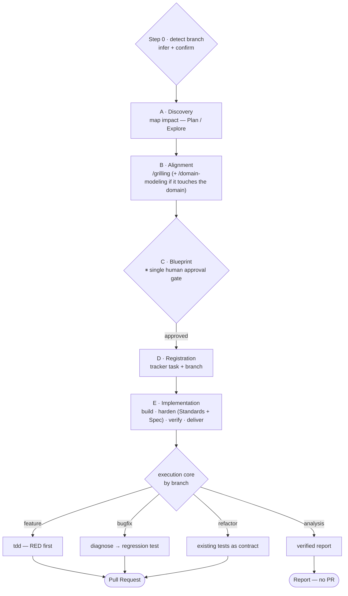

# development-skills

An **opinionated** agent workflow for building software with **DDD + hexagonal architecture + strict TDD**, packaged as [Claude Code](https://www.anthropic.com/claude-code) skills.

At its center is `develop`: a thin **router** that gives every non-trivial task the same backbone — *align before you code* — and delegates the middle to focused skills.

> This is opinionated by design. Read [PHILOSOPHY.md](./PHILOSOPHY.md) before adopting it.

## The flow

`develop` routes each task through five phases and one of four branches. Phases A–D are common; the branch (detected in Step 0) governs the execution core in phase E and the exit.



| Branch | When | Execution core | Exit |
|--------|------|----------------|------|
| feature | new code / use case | `tdd` — RED first | tests + build → PR |
| bugfix | something broken | `diagnose` → RED regression test | regression green → PR |
| refactor | behavior-preserving | existing tests as contract | tests still green → PR |
| analysis | audit, no code | discovery + adversarial verification | verified report — no PR |

## Skills

| Skill | Role |
|-------|------|
| `develop` | the router — owns the process, delegates the middle |
| `grilling` | the alignment interview (model-invocable core) |
| `domain-modeling` | glossary + decisions into `.context/` (model-invocable core) |
| `grill-me` / `grill-with-docs` | user-only entry points that run the cores |
| `to-spec` | turn context into a spec, publish to the tracker |
| `to-tickets` | break a plan into independently-grabbable tracer-bullet tickets |
| `tdd` | red-green-refactor loop |
| `diagnose` | disciplined reproduce → root-cause → regression-test loop |
| `prototype` | throwaway prototype to answer a design question |
| `create-pr` | commit, push, open the PR (generic) |
| `setup` | scaffold a repo's tracker / labels / domain-doc config |

**Cores vs wrappers:** `grilling` and `domain-modeling` are model-invocable — `develop` and the model call them directly. `grill-me` / `grill-with-docs` are user-only entry points (`disable-model-invocation`); you invoke them with `/grill-me`, the model doesn't.

## Install

```bash
./install.sh          # symlinks skills/ into ~/.claude/skills/
```

Or copy `skills/*` into your Claude Code skills directory. Then run `/setup` once per repo to configure its issue tracker (GitHub by default) and labels.

## Conventions live in your repo, not here

Everything project-specific — test commands, architecture naming, CI, PR rules, the domain glossary — lives in your repo's `.context/`. The skills **read** it; they hardcode nothing. See [`examples/.context/`](./examples/.context/) for the slots each skill expects.

## Credit

Derived from [mattpocock/skills](https://github.com/mattpocock/skills) (MIT). See [LICENSE](./LICENSE) and [PHILOSOPHY.md](./PHILOSOPHY.md#credit).
